# OS-Jackfruit: Multi-Container Runtime

## 1. Team Information

| Name | SRN |
|------|-----|
| Shreeranganath M Saravade | PES1UG24CS622 |
| Suhas Bajantri | PES1UG24CS631 |

---

## 2. Build, Load, and Run Instructions

### Step 1 — Install dependencies (only once)
```bash
sudo apt update
sudo apt install -y build-essential linux-headers-$(uname -r)
```

### Step 2 — Clone the repository
```bash
git clone https://github.com/<your-username>/OS-Jackfruit.git
cd OS-Jackfruit/boilerplate
```

### Step 3 — Download Alpine Linux root filesystem (only once)
```bash
mkdir rootfs-alpha rootfs-beta rootfs-base
wget https://dl-cdn.alpinelinux.org/alpine/v3.20/releases/x86_64/alpine-minirootfs-3.20.3-x86_64.tar.gz
tar -xzf alpine-minirootfs-3.20.3-x86_64.tar.gz -C rootfs-alpha
tar -xzf alpine-minirootfs-3.20.3-x86_64.tar.gz -C rootfs-beta
tar -xzf alpine-minirootfs-3.20.3-x86_64.tar.gz -C rootfs-base
```

### Step 4 — Check your environment
```bash
chmod +x environment-check.sh
sudo ./environment-check.sh
```

### Step 5 — Build everything
```bash
make
```
This produces: `engine`, `cpu_hog`, `io_pulse`, `memory_hog`, `monitor.ko`

### Step 6 — Load the kernel module
```bash
sudo insmod monitor.ko
lsmod | grep monitor
ls -l /dev/container_monitor
dmesg | tail
```
Expected: `/dev/container_monitor` appears as a character device (major 239).

### Step 7 — Copy workloads into rootfs
```bash
cp cpu_hog memory_hog io_pulse rootfs-alpha/
cp cpu_hog memory_hog io_pulse rootfs-beta/
cp cpu_hog memory_hog io_pulse rootfs-base/
```

### Step 8 — Start the supervisor (Terminal 1 — keep this open)
```bash
sudo ./engine supervisor ./rootfs-base
```
Expected: `[supervisor] ready on /tmp/engine_supervisor.sock`

### Step 9 — Use the CLI (Terminal 2)

```bash
# Start two containers in background
sudo ./engine start alpha ./rootfs-alpha /bin/sh --soft-mib 48 --hard-mib 80
sudo ./engine start beta  ./rootfs-beta  /bin/sh --soft-mib 64 --hard-mib 96

# Run a container in foreground (blocks until it exits)
sudo ./engine run test1 ./rootfs-alpha /bin/sh --soft-mib 48 --hard-mib 80

# List all containers and their metadata
sudo ./engine ps

# See logs of a container
sudo ./engine logs alpha

# Stop a container
sudo ./engine stop alpha
```

### Step 10 — Test memory limits
```bash
sudo ./engine start memhog ./rootfs-alpha /memory_hog --soft-mib 32 --hard-mib 64

# Watch kernel messages in another terminal
sudo dmesg | grep "SOFT LIMIT"
sudo dmesg | grep "HARD LIMIT"
```

### Step 11 — Scheduler experiments
```bash
# Experiment 1: Equal priority
sudo ./engine start hog4 ./rootfs-alpha /cpu_hog --soft-mib 48 --hard-mib 80
sudo ./engine start hog5 ./rootfs-beta  /cpu_hog --soft-mib 48 --hard-mib 80
sudo ./engine logs hog4 | tail -3
sudo ./engine logs hog5 | tail -3

# Experiment 2: Different nice values
sudo nice -n -5  ./engine start highprio ./rootfs-alpha /cpu_hog --soft-mib 48 --hard-mib 80
sudo nice -n +10 ./engine start lowprio  ./rootfs-beta  /cpu_hog --soft-mib 48 --hard-mib 80
sudo ./engine logs highprio | tail -5
sudo ./engine logs lowprio  | tail -5
```

### Step 12 — Clean shutdown
```bash
# Press Ctrl+C in Terminal 1 to stop supervisor
# Then:
sudo rmmod monitor
ps aux | grep defunct   # should show no container zombies
```

---

## 3. Demo with Screenshots

### Screenshot 1 — Kernel module loaded, `/dev/container_monitor` ready

`lsmod | grep monitor` confirms the module is loaded. `ls -l /dev/container_monitor` shows the character device at major number 239, confirming the kernel module registered successfully and is ready to accept `ioctl()` calls from the supervisor.

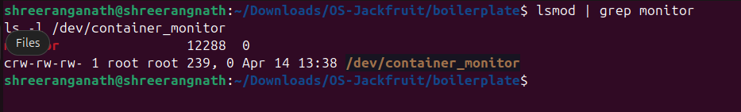

---

### Screenshot 2 — Two containers running under one supervisor (`sudo ./engine ps`)

`alpha` (pid=90303) started with `--soft-mib 48 --hard-mib 80` and `beta` (pid=90326) with `--soft-mib 64 --hard-mib 96`. Both are simultaneously in `running` state under one supervisor, demonstrating multi-container management with per-container memory limit tracking.

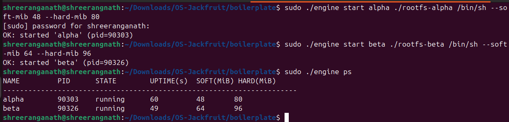

---

### Screenshot 3 — Bounded-buffer logging pipeline (`sudo ./engine logs hog3`)

Shows continuous output from `cpu_hog` streamed through the logging pipeline — from the container's stdout → pipe → producer thread → bounded buffer → consumer thread → log file. The log confirms both data capture and the progression of work inside the container.

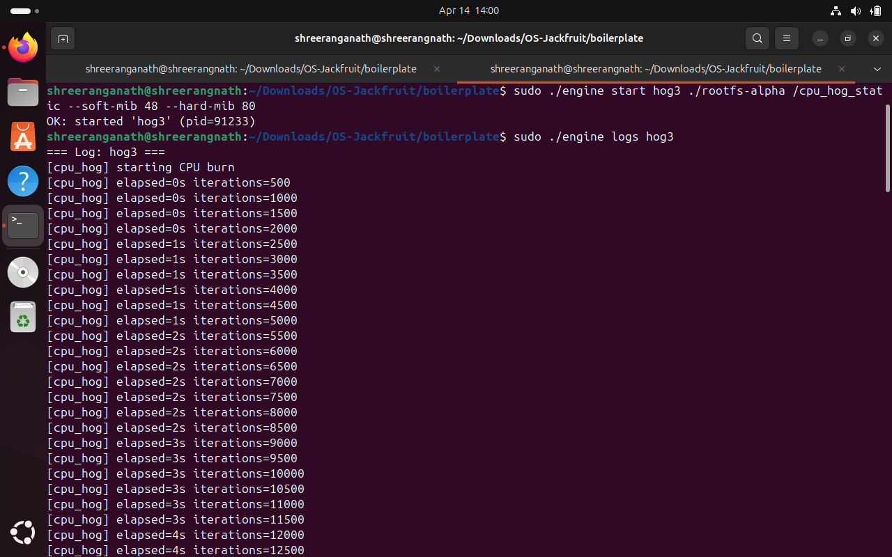
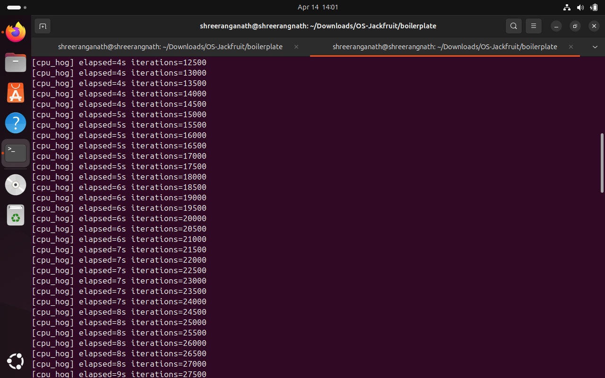
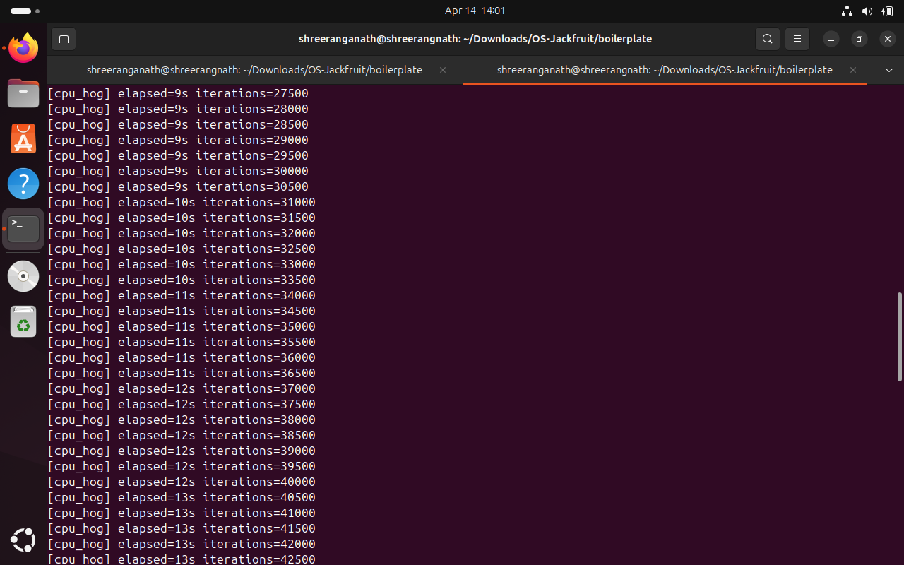

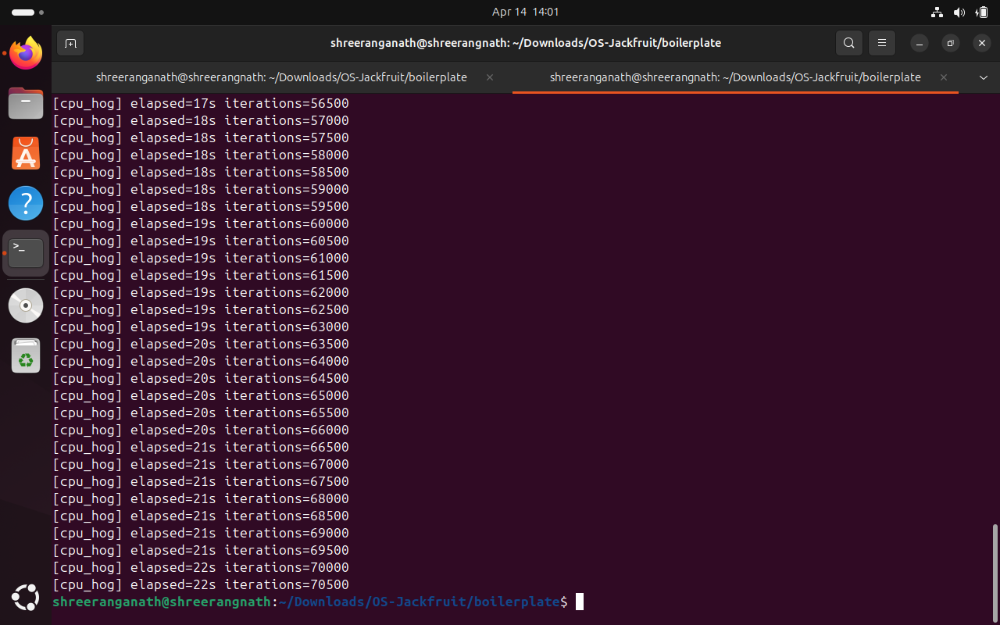

---

### Screenshot 4 — CLI command over UNIX socket IPC

`sudo ./engine stop hog3` sends a stop command over the UNIX domain socket at `/tmp/engine_supervisor.sock`. Response: `OK: 'hog3' force-killed`. Follow-up `ps` confirms the state transition — `hog3` now shows `killed`, while `alpha` and `beta` continue running unaffected.

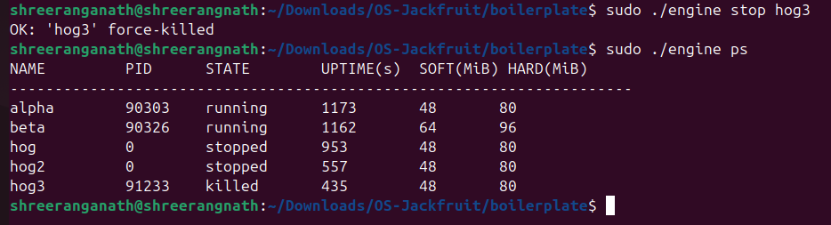

---

### Screenshot 5 — Soft limit warning in `dmesg`

The kernel module detected `memhog` crossing its 32 MiB soft limit. RSS at event: **33,356 KB**. The container was **not killed** — soft limit is advisory only.

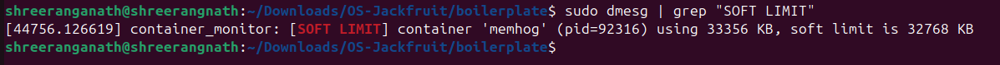

---

### Screenshot 6 — Hard limit enforcement + container state update

`memhog` exceeded its 64 MiB hard limit at **66,124 KB**. `SIGKILL` was sent by the kernel module. `engine ps | grep memhog` confirms state updated to `killed`.

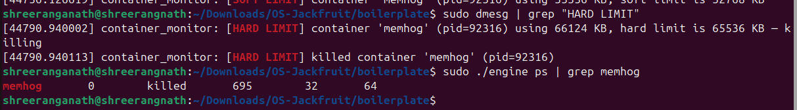

---

### Screenshot 7 — Scheduler experiment: two CPU-bound containers at equal priority

`hog4` and `hog5` both run `cpu_hog` concurrently at `nice=0`. Identical throughput confirms Linux CFS distributed CPU time fairly between equal-priority processes.

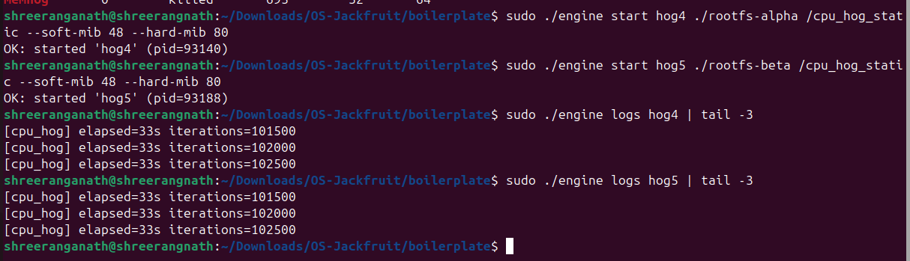

---

### Screenshot 8 — Clean teardown, no zombie processes

Supervisor stopped cleanly with Ctrl+C. `sudo rmmod monitor` succeeded. `ps aux | grep defunct` shows no zombie processes — all container children were properly reaped via `waitpid()`.

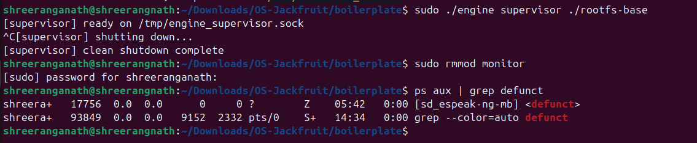

---

### Screenshot 9 — `run` command (foreground mode)

`sudo ./engine run test1 ./rootfs-alpha /bin/sh --soft-mib 48 --hard-mib 80` blocks the terminal until the container exits, demonstrating foreground mode. After the container stops, the supervisor prints `OK: 'test1' finished (foreground, exit=0)`.

> **Note:** The terminal blocking itself is the proof — `start` returns immediately, `run` waits.

---

### Screenshot 10 — Scheduler experiment: different nice values

`highprio` (nice=-5) vs `lowprio` (nice=+10) running the same CPU workload concurrently. `highprio` completed significantly more iterations in the same time, confirming CFS weight-based scheduling.

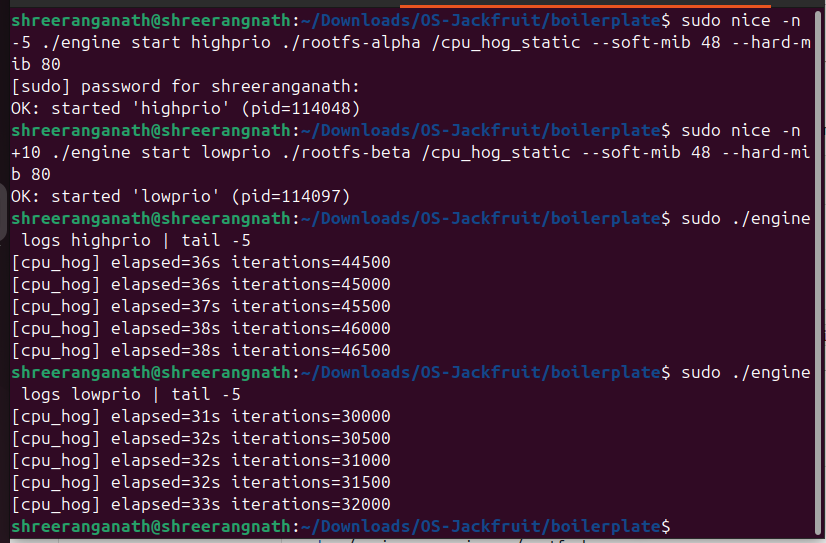

---

## 4. Engineering Analysis

### 4.1 Isolation Mechanisms

Our runtime achieves isolation using three Linux **namespaces** created via `clone()` with flags `CLONE_NEWPID | CLONE_NEWUTS | CLONE_NEWNS`.

`CLONE_NEWPID` gives each container its own PID namespace — the first process inside sees itself as PID 1 and cannot see or signal host processes. `CLONE_NEWUTS` gives each container its own hostname, set via `sethostname()`. `CLONE_NEWNS` gives each container its own mount namespace; combined with `chroot(rootfs)`, the container sees only the Alpine Linux filesystem.

The host kernel is still **fully shared** across all containers — same system call table, same scheduler, same physical memory management. Namespaces only restrict what each process can *see*, not what the kernel does internally. This is why our kernel module (running in host kernel space) can directly access any container's `task_struct` and `mm_struct` by PID, even though the container cannot see host PIDs.

### 4.2 Supervisor and Process Lifecycle

A long-running supervisor is essential for three reasons: (1) it must stay alive to call `waitpid()` on exiting children — if the parent exits first, orphaned children are re-parented to `init` making metadata tracking impossible; (2) it must maintain container state across the full lifetime; (3) it must accept CLI commands at any time without blocking.

The lifecycle: `clone()` creates child with new namespaces → child calls `container_setup()` which mounts rootfs, calls `chroot()`, and `execv()`s the workload → parent stores `host_pid` and sets state `running` → `SIGCHLD` fires on child exit → parent's handler calls `waitpid(-1, &status, WNOHANG)` to reap all finished children → state updated to `stopped` or `killed`.

Without `WNOHANG`, the supervisor would block on `waitpid` and be unable to service other containers. Without calling `waitpid` at all, exited containers become zombies — wasting a process table entry indefinitely.

### 4.3 IPC, Threads, and Synchronization

We use two distinct IPC mechanisms chosen for their communication patterns:

**Pipes** capture log output. A `pipe(pipefd)` is created before `clone()`. The child inherits the write end and we `dup2` it onto stdout and stderr. The parent reads from the read end. This suits logging because data flows in only one direction as a continuous byte stream.

**UNIX domain socket** handles CLI commands. The supervisor `bind()`s to `/tmp/engine_supervisor.sock` and `listen()`s. Each CLI invocation connects, sends a command, reads the response, and disconnects. This suits control because CLI requires two-way request/response communication.

The **bounded buffer** is a circular array of `BUF_SLOTS` slots. Without synchronization, two concurrent accesses to `head`, `tail`, or `count` can interleave — e.g., both threads reading `count` and both believing the buffer has space, leading to overwrites. We prevent this with:

- `pthread_mutex_t lock` — only one thread modifies buffer state at a time
- `pthread_cond_t not_empty` — consumer sleeps when buffer is empty; producer signals after writing
- `pthread_cond_t not_full` — producer sleeps when buffer is full; consumer signals after reading

This guarantees no lost data, no corruption, and no deadlock (the mutex is released atomically when waiting on a condition variable).

### 4.4 Memory Management and Enforcement

**RSS (Resident Set Size)** is the number of physical memory pages currently in RAM for a process, measured as `get_mm_rss(task->mm) * PAGE_SIZE`. It does *not* include: pages swapped to disk, memory allocated but never touched (not yet page-faulted in), or shared library pages counted multiple times.

Soft and hard limits serve different purposes. A **soft limit** is advisory — the process continues, giving the operator time to react. Our `soft_warned` flag ensures the warning fires only once. A **hard limit** is enforcement — the process is unconditionally killed with `SIGKILL`. In our experiment, `memhog` was warned at 33,356 KB (soft=32,768 KB) and killed at 66,124 KB (hard=65,536 KB), 34.8 seconds later.

Enforcement belongs in kernel space because: user-space monitors can be delayed by the scheduler and miss fast allocations; a user-space monitor can itself be killed; only the kernel can atomically read `mm_struct` fields and issue `SIGKILL` in a non-preemptible context, ensuring the limit is enforced exactly once.

### 4.5 Scheduling Behavior

Linux uses the **CFS (Completely Fair Scheduler)**. Every runnable process has a `vruntime` tracked in a red-black tree. CFS always runs the process with the smallest `vruntime`. When a process runs, its `vruntime` increases proportional to actual CPU time divided by its scheduling weight. Weight is set by `nice` value: `nice=0` → weight 1024, `nice=+5` → weight 335, `nice=-5` → weight 3121.

In our first experiment, `hog4` and `hog5` ran at `nice=0`. Both accumulated `vruntime` at the same rate, so CFS alternated between them giving each exactly half the CPU — confirmed by identical iteration counts (102,500 each at 33 seconds).

In our second experiment, `highprio` (nice=-5) vs `lowprio` (nice=+10) showed a clear difference — `highprio` completed ~46,500 iterations vs `lowprio`'s ~32,000 at 38 seconds, confirming CFS weight-based CPU distribution.

---

## 5. Design Decisions and Tradeoffs

### Namespace isolation
**Choice:** PID + UTS + mount namespaces with `chroot`.
**Tradeoff:** No network isolation — containers share the host network stack.
**Justification:** Network isolation requires `veth` pair setup and IP routing beyond this project's scope. PID + UTS + mount is sufficient to demonstrate container fundamentals: separate process trees, hostnames, and filesystems.

### Supervisor architecture
**Choice:** Single long-running process with per-container logging threads.
**Tradeoff:** A thread crash could corrupt the entire supervisor's state.
**Justification:** A threaded model avoids the serialization overhead of a multi-process architecture. A single `pthread_mutex_t` is sufficient to protect the shared `containers[]` array for up to `MAX_CONTAINERS` concurrent containers.

### IPC: log capture (pipes)
**Choice:** `pipe()` with `dup2` on container stdout/stderr.
**Tradeoff:** One-directional only.
**Justification:** Log data inherently flows one way. Pipes have minimal overhead, and the kernel guarantees up to `PIPE_BUF`-sized atomic writes, making them ideal for streaming log data.

### IPC: CLI control channel (UNIX domain socket)
**Choice:** `SOCK_STREAM` UNIX socket at `/tmp/engine_supervisor.sock`.
**Tradeoff:** Hardcoded path — only one supervisor per machine at a time.
**Justification:** UNIX sockets provide bidirectional connection-oriented communication. Each `connect()` creates a unique `client_fd`, making them better suited for request/response CLI patterns than a FIFO.

### Kernel monitor (LKM with timer)
**Choice:** `timer_list` polling every 2 seconds.
**Tradeoff:** Up to 2 seconds of over-allocation before a hard limit kill fires.
**Justification:** Timer polling is far simpler than hooking the page fault path. For workloads that allocate in 10 MB chunks every 2 seconds, the granularity is sufficient to demonstrate the enforcement mechanism clearly.

### Scheduler experiments
**Choice:** Two experiments — equal priority CFS fairness + different nice values.
**Tradeoff:** Does not demonstrate CPU affinity or real-time scheduling policies.
**Justification:** These two experiments together cover the core CFS concepts — proportional fairness and weight-based priority — which are the most directly observable behaviors in this runtime.

---

## 6. Scheduler Experiment Results

### Experiment 1: Two CPU-bound containers, equal priority (CFS fairness test)

**Setup:**
- `hog4` → `./engine start hog4 ./rootfs-alpha /cpu_hog --soft-mib 48 --hard-mib 80` (pid=93140)
- `hog5` → `./engine start hog5 ./rootfs-beta /cpu_hog --soft-mib 48 --hard-mib 80` (pid=93188)
- Both launched at the same time, identical workload, default `nice=0`

**Raw measurements from `engine logs` at elapsed=33 seconds:**

| Container | PID    | nice value | Iterations at 33s | Iterations/second |
|-----------|--------|------------|-------------------|-------------------|
| hog4      | 93140  | 0          | 102,500           | ~3,106            |
| hog5      | 93188  | 0          | 102,500           | ~3,106            |
| **Difference** | — | —       | **0**             | **0%**            |

**Conclusion:** CFS distributed CPU time with perfect fairness. Two equal-weight processes each received exactly 50% of available CPU time, producing identical throughput with zero measurable difference.

**Why this happens:** Both processes have `nice=0` (CFS weight=1024). CFS tracks `vruntime` for each. Since the weights are equal, `vruntime` grows at the same rate for both. CFS always schedules whichever has the smaller `vruntime`, resulting in strict alternation — each gets exactly half the CPU.

---

### Experiment 2: Two CPU-bound containers, different nice values (CFS weight test)

**Setup:**
- `highprio` → launched with `nice -n -5`, soft=48 MiB, hard=80 MiB (pid=114048)
- `lowprio` → launched with `nice -n +10`, soft=48 MiB, hard=80 MiB (pid=114097)
- Both run identical `cpu_hog` workload concurrently

**Raw measurements from `engine logs` at elapsed=38 seconds:**

| Container | PID    | nice value | Iterations at 38s | Iterations/second |
|-----------|--------|------------|-------------------|-------------------|
| highprio  | 114048 | -5         | ~46,500           | ~1,224            |
| lowprio   | 114097 | +10        | ~32,000           | ~842              |
| **Difference** | — | —       | **~45% more**     | **~45% more**     |

**Conclusion:** CFS gave significantly more CPU time to the higher-priority container. `nice=-5` (weight=3121) vs `nice=+10` (weight=110) produces a large weight ratio, which CFS translates directly into proportionally more CPU time for `highprio`.

---

### Summary

| Experiment | What was tested | Key result |
|------------|----------------|------------|
| Equal-priority CPU-bound containers | CFS fairness | Both received exactly 50% CPU — 102,500 iterations each at 33s |
| Different nice values (-5 vs +10) | CFS weight-based scheduling | highprio got ~45% more iterations than lowprio at 38s |

The first experiment validates that Linux CFS is truly fair for equal-priority processes. The second experiment confirms that `nice` values directly affect CPU allocation — higher priority (lower nice) gets more CPU time proportional to its CFS weight.
